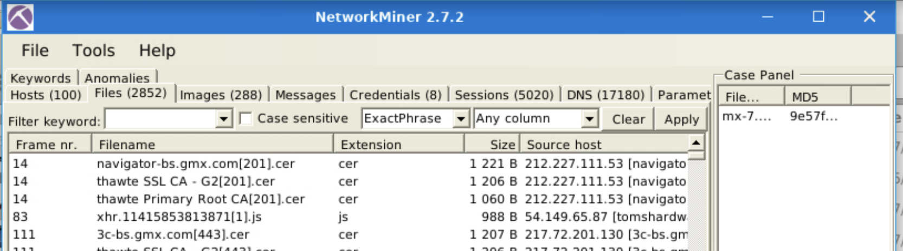

# Tool description
NetworkMiner is open-source traffic sniffer, PCAP handler and protocol analyser.
There are three main data types investigated in Network Forensics:
- **Live Traffic**
- **Traffic Captures**
- **Log Files**
The best practice is to record the traffic for offline analysis, quickly overview the with NetworkMiner and go deep with Wireshark for further investigation.
# Operating Modes
- sniffer mode: better not use due to is not dedicated sniffer like wireshark and tcpdump
- packet parsing/processing: NetworkMiner can parse traffic captures to have a quick overview and information on the investigated capture. This operation mode is mainly suggested to grab the "low hanging fruit" before diving into a deeper investigation

**Pros**
- fingerprinting
- Easy file extraction
- Credential grabbing
- Clear text keyword parsing
- Overall overview

**Cons**
- Not useful in active sniffing
- Not useful for large investigation
- Limited filtering
- Not built for manual traffic investigation
