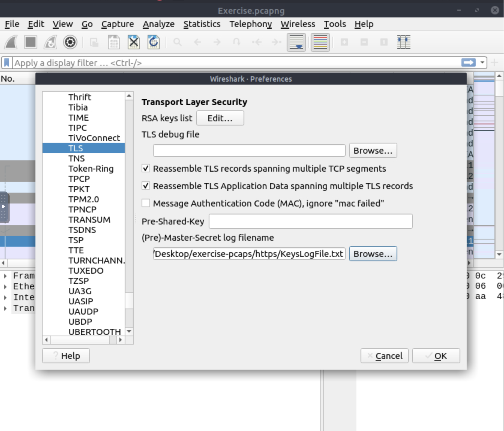

In this note i will explain how to find anomalies on you network with Wireshark.

One of the most popular scanning tool is nmap. As a scanning tool it must generate a lot of traffic.
# Nmap Scans
Nmap use two protocol: UDP and TCP. 
## TCP
### TCP Connect Scan
Use full three-way handshake, usually has a windows size larger than 1024 bytes.
### TCP Syn Scan
Use only SYN and RST, usually have a size less than or equal to 1024 bytes.
## UDP
Nmap try to find open ports and if port unreachable dst host generate icmp message that contain encapsulated original udp request.

---
# ARP Poisoning & Man In The Middle
Some useful features for wireshark filtering:
- `arp.opcode == 1` - ARP requests
- `arp.opcode == 2` - ARP responses
- `arp.dst.hw_mac==00:00:00:00:00:00` - ARP scanning
- `arp.duplicate-address-detected or arp.duplicate-address-frame` - possible ARP poisoning detection
- `((arp) && (arp.opcode == 1)) && (arp.src.hw_mac == target-mac-address)` - possible ARP flooding
---
# Identifying Hosts
## DHCP Analysis
Wireshark filters:
- `dhcp.option.dhcp == 3` - request
- `dhcp.option.dhcp == 5` - ACK
- `dhcp.option.dhcp == 6` - NAK
- `dhcp.option.hostname contains "keyword"`
- `dhcp.option.domain_name contains "keyword"`
## NetBIOS (NBNS) Analysis
NBNS allows diff app on diff hosts to communicate with each other.
Wireshark filters:
- `nbns`
- `nbns.name contains "keyword"`
## Kerberos Analysis
Sign `$` before the name mean that this is hostname(workstation) and name without `$` mean that this is user.
Wireshark filters:
- `kerberos`
- `kerberos.CNameString contains "keyword"` - CNameString is username
- `kerberos.CNameString and !(kerberos.CNameString contains "$" )`
- `kerberos.pvno == 5` - pvno is protocol version

- `kerberos.realm contains ".org"` - realm is domain name

- `kerberos.SNameString == "krbtg"` 
---
# Tunnelling Traffic
Attackers use tunnelling to bypass security perimeters using the standart and trusted protocols like ICMP and DNS.
## ICMP Analysis
As ICMP is trusted network layer protocol, sometimes it used for Dos attacks, data exfiltration and C2 tunnelling.
I think its good practise to limit ICMP traffic in private network.

Wireshark filter:
- `icmp`
- `data.len > 64 and icmp` - but attackers can modify len of ICMP
## DNS Analysis
Attacker can create domain address and configure it as a C2 channel. After exploitation attacker sends DNS queries to the C2 server.
Mostly these queries are longer than default DNS queries.

Wireshark filter:
- `dns`
- `dns contains "dnscat"` - known pattern
- `dns.qry.name.len > 15 and !mdns` - !mdns disable local link dev queries
---
# CPA(cleartext protocol Analysis) FTP
FTP focus rather on simplicity than security. As a result of this, using this protocol in unsecured environments could create security issues.
**FTP analysis in a nutshell:**

| **Notes**                                                                                                                                                                                                                                               | **Wireshark Filter**                                                                                                                                                                          |
| ------------------------------------------------------------------------------------------------------------------------------------------------------------------------------------------------------------------------------------------------------- | --------------------------------------------------------------------------------------------------------------------------------------------------------------------------------------------- |
| Global search                                                                                                                                                                                                                                           | - `ftp`                                                                                                                                                                                       |
| **"FTP"** options for grabbing the low-hanging fruits:  - **x1x series:** Information request responses. - **x2x series:** Connection messages. - **x3x series:** Authentication messages.  **Note:** "200" means command successful. | **---**                                                                                                                                                                                       |
| **"x1x" series options for grabbing the low-hanging fruits:**  - **211:** System status. - **212:** Directory status. - **213:** File status                                                                                                | - `ftp.response.code == 211`                                                                                                                                                                  |
| **"x2x" series options for grabbing the low-hanging fruits:**  - **220:** Service ready. - **227:** Entering passive mode. - **228:** Long passive mode. - **229:** Extended passive mode.                                               | - `ftp.response.code == 227`                                                                                                                                                                  |
| **"x3x" series options for grabbing the low-hanging fruits:**  - **230:** User login. - **231:** User logout. - **331:** Valid username. - **430:** Invalid username or password - **530:** No login, invalid password.               | - `ftp.response.code == 230`                                                                                                                                                                  |
| **"FTP" commands for grabbing the low-hanging fruits:**  - **USER:** Username. - **PASS:** Password. - **CWD:** Current work directory. - **LIST:** List.                                                                                | - `ftp.request.command == "USER"`  - `ftp.request.command == "PASS"`  - `ftp.request.arg == "password"`                                                                           |
| Advanced usages examples for grabbing low-hanging fruits:  - **Bruteforce signal:** List failed login attempts. - **Bruteforce signal:** List target username. - **Password spray signal:** List targets for a static password.             | - `ftp.response.code == 530`  - `(ftp.response.code == 530) and (ftp.response.arg contains "username")`  - `(ftp.request.command == "PASS" ) and (ftp.request.arg == "password")` |

---
# CPA: HTTP
**HTTP analysis in a nutshell:**

|                                                                                                                                                                                                                                                                                                                                                                                                                                                                                                                                                                                                                                                                                                                                                                                                                                                                   |                                                                                                                                                                                                                        |
| ----------------------------------------------------------------------------------------------------------------------------------------------------------------------------------------------------------------------------------------------------------------------------------------------------------------------------------------------------------------------------------------------------------------------------------------------------------------------------------------------------------------------------------------------------------------------------------------------------------------------------------------------------------------------------------------------------------------------------------------------------------------------------------------------------------------------------------------------------------------- | ---------------------------------------------------------------------------------------------------------------------------------------------------------------------------------------------------------------------- |
| **Notes**                                                                                                                                                                                                                                                                                                                                                                                                                                                                                                                                                                                                                                                                                                                                                                                                                                                         | **Wireshark Filter**                                                                                                                                                                                                   |
| Global search  **Note:** HTTP2 is a revision of the protocol for better performance and security. It supports binary data transfer and request&response multiplexing.                                                                                                                                                                                                                                                                                                                                                                                                                                                                                                                                                                                                                                                                                       | - `http`  - `http2`                                                                                                                                                                                              |
| "HTTP **Request Methods"** for grabbing the low-hanging fruits:  - GET - POST - Request: Listing all requests                                                                                                                                                                                                                                                                                                                                                                                                                                                                                                                                                                                                                                                                                                                                         | - `http.request.method == "GET"`  - `http.request.method == "POST"`  - `http.request`                                                                                                                      |
| " ** HTTP Response Status Codes" for grabbing the low-hanging fruits:**  - **200 OK:** Request successful. - **301 Moved Permanently:** Resource is moved to a new URL/path (permanently). - **302 Moved Temporarily:** Resource is moved to a new URL/path (temporarily). - **400 Bad Request:** Server didn't understand the request. - **401 Unauthorised:** URL needs authorisation (login, etc.). - **403 Forbidden:** No access to the requested URL.  - **404 Not Found:** Server can't find the requested URL. - **405 Method Not Allowed:** Used method is not suitable or blocked. - **408 Request Timeout:**  Request look longer than server wait time. - **500 Internal Server Error:** Request not completed, unexpected error. - **503 Service Unavailable:** Request not completed server or service is down. | - `http.response.code == 200`  - `http.response.code == 401`  - `http.response.code == 403`  - `http.response.code == 404`  - `http.response.code == 405`  - `http.response.code == 503` |
| **"** ** HTTP Parameters" for grabbing the low-hanging fruits:**  - **User agent:** Browser and operating system identification to a web server application. - **Request URI:** Points the requested resource from the server. - **Full *URI:** Complete URI information.  ***URI:** Uniform Resource Identifier.                                                                                                                                                                                                                                                                                                                                                                                                                                                                                                                               | - `http.user_agent contains "nmap"`  - `http.request.uri contains "admin"`  - `http.request.full_uri contains "admin"`                                                                                     |
| **" HTTP Parameters" for grabbing the low-hanging fruits:**  - **Server:** Server service name. - **Host:** Hostname of the server - **Connection:** Connection status. - **Line-based text data:** Cleartext data provided by the server. - **HTML Form URL Encoded:** Web form information.                                                                                                                                                                                                                                                                                                                                                                                                                                                                                                                                                   | - `http.server contains "apache"`  - `http.host contains "keyword"`  - `http.host == "keyword"`  - `http.connection == "Keep-Alive"`  - `data-text-lines contains "keyword"`                   |
## User Agent Analysis
The "user-agent" field is one of the great resources for spotting anomalies in HTTP traffic. In some cases, adversaries successfully modify the user-agent data, which could look super natural.
**User Agent analysis in a nutshell:**

|                                                                                                                                                                                                                                                                                                                                                                                                                          |                                                                                                                                                          |
| ------------------------------------------------------------------------------------------------------------------------------------------------------------------------------------------------------------------------------------------------------------------------------------------------------------------------------------------------------------------------------------------------------------------------ | -------------------------------------------------------------------------------------------------------------------------------------------------------- |
| **Notes**                                                                                                                                                                                                                                                                                                                                                                                                                | **Wireshark Filter**                                                                                                                                     |
| Global search.                                                                                                                                                                                                                                                                                                                                                                                                           | - `http.user_agent`                                                                                                                                      |
| **Research outcomes for grabbing the low-hanging fruits:**  - Different user agent information from the same host in a short time notice. - Non-standard and custom user agent info. - Subtle spelling differences. **("Mozilla" is not the same as  "Mozlilla" or "Mozlila")** - Audit tools info like Nmap, Nikto, Wfuzz and sqlmap in the user agent field. - Payload data in the user agent field. | - `(http.user_agent contains "sqlmap") or (http.user_agent contains "Nmap") or (http.user_agent contains "Wfuzz") or (http.user_agent contains "Nikto")` |

---
# Encrypted protocol analysis: Decrypting HTTPS
Wireshark filter:
- `http.request`

- `tls`

- `tls.handshake.type == 1` - client request

- `tls.handshake.type == 2` - server response

- `ssdp` - network protocol that provides advertisement and discovery of network services
In order to decrypt https traffic we need to save keys. We can set our browser to store used keys in a file and than import that file to wireshark:

In order to export some files that traveled through internet we can use File->export object->http

---
# Hunt clear text creds
There are some built in features that can help finding creds in wireshark. In wireshark v3.1 and later you can follow Tool->Credentials. It is suggested to have manual checks and not entirely rely on this feature to decide if there is a cleartext credential in the traffic.

---
# Actionable Results
As a security analyst, there will be some cases you need to spot the anomaly, identify the source and take action.
Wireshark can help create firewall rules for:
- Netfilter (iptables)
- Cisco IOS (standard/extended)
- IP Filter (ipfilter)
- IPFirewall (ipfw)
- Packet filter (pf)
- Windows Firewall (netsh new/old format)