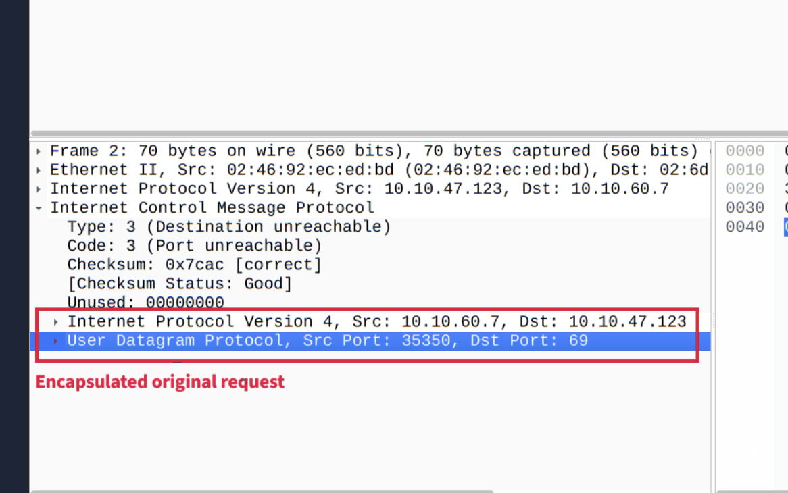

In this note i will explain how to find anomalies on you network with Wireshark.

One of the most popular scanning tool is nmap. As a scanning tool it must generate a lot of traffic.
# Nmap Scans
Nmap use two protocol: UDP and TCP. 
## TCP
### TCP Connect Scan
Use full three-way handshake, usually has a windows size larger than 1024 bytes.
### TCP Syn Scan
Use only SYN and RST, usually have a size less than or equal to 1024 bytes.
## UDP
Nmap try to find open ports and if port unreachable dst host generate icmp message that contain encapsulated original udp request.

---
# ARP Poisoning & Man In The Middle

